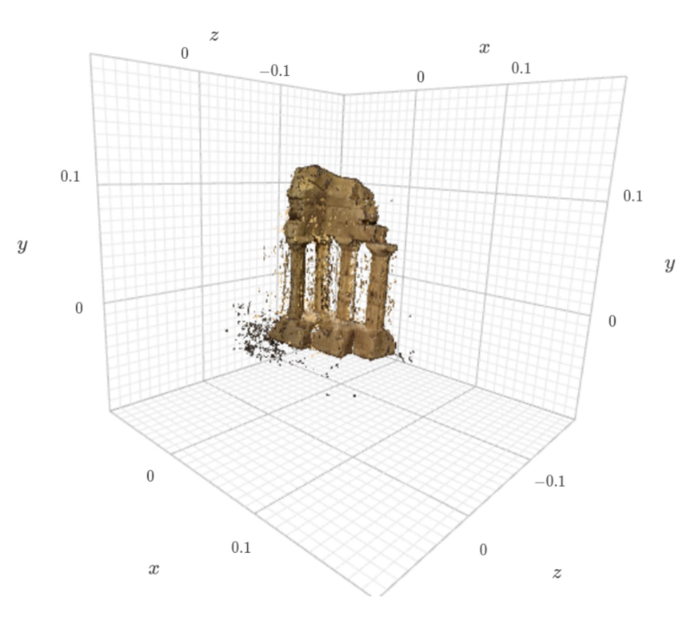

# Implementation of two-view stereo and multi-view stereo algorithm

The aim of this project was to use two view and multiple view images to form a 3D reconstruction of the object of interest. For multi-view stereo the plane sweep algorithm was implemented.

#### Two view stereo implementation steps

- Rectify the views to get the epipolar lines to be horizontal.
- Compute disparity map using ssd,sad and zncc kernels.
- Added LR consistency check for handling occlusion and removing outliers.
- Reconstruction of the scene using disparity map and multi-pair aggregation.

SSD

SAD

ZNCC

#### Multi view stereo 

- Sweeped a series of imaginary depth planes (in this example, fronto-parallel
with the reference view) across a range of candidate depths and project neighboring views onto
the imaginary depth plane and back onto the reference view via a computed collineation.
- Constructed the cost volume by repeating the aforementioned steps across each of
the depth planes to be swept over and stacking each resulting cost map along the depth axis.
-Reconstruction of the scene using obtained depth (argmin of cost map)

Cost volume visualisation.

  

Final result of the Multi-view stereo reconstruction
